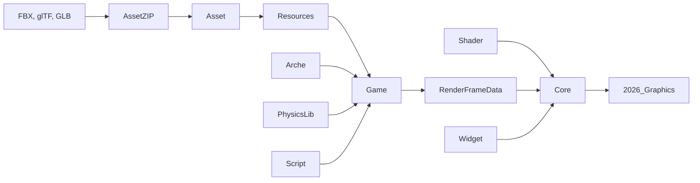
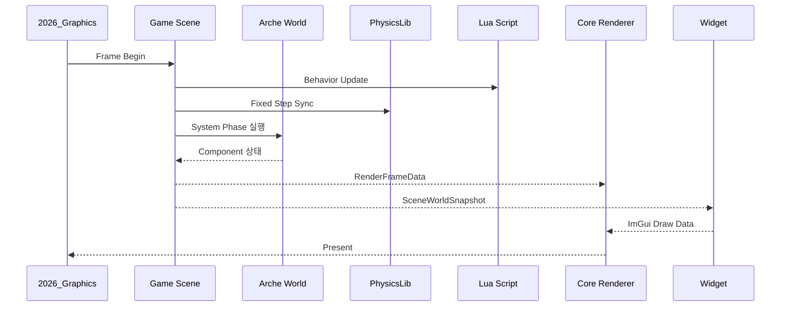
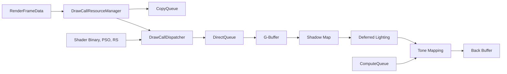
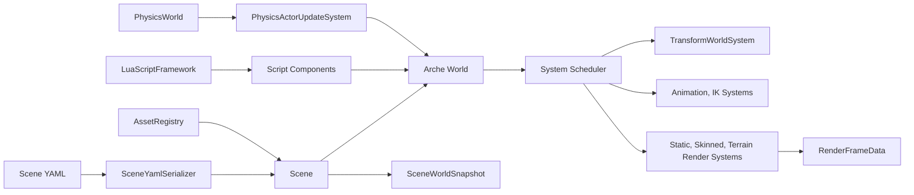
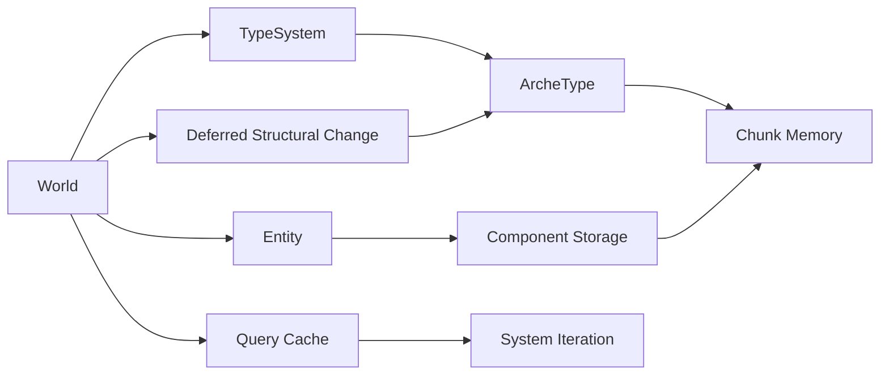
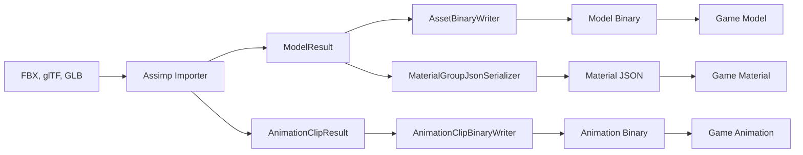
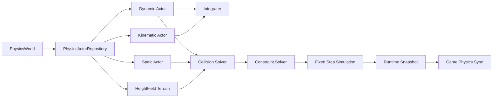
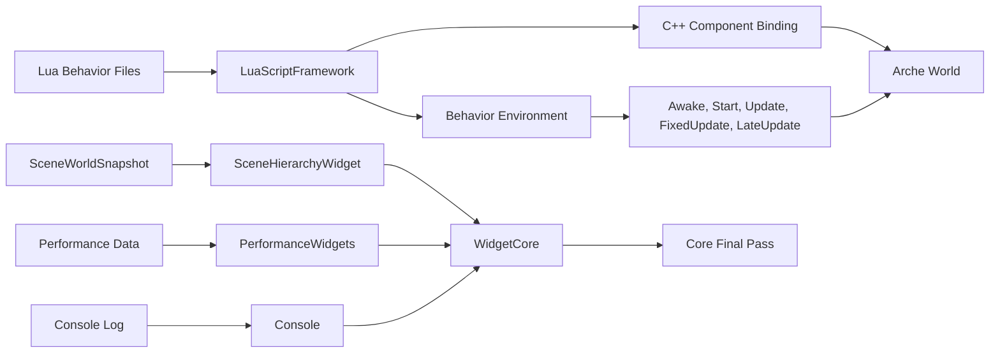

# 2026Graphics

<p>

</p>

2026Graphics는 DirectX 12 기반의 실시간 3D 그래픽스 샌드박스입니다.
렌더링 파이프라인, ECS, 씬 시스템, 에셋 변환 도구, Lua 스크립팅, 물리 시뮬레이션, ImGui 디버그 도구를 하나의 Win32 런타임으로 직접 연결합니다.

외부 게임 엔진을 사용하지 않고 그래픽스 런타임의 주요 계층을 직접 구현하는 것을 목표로 합니다. 기본 씬은 데이터 파일에서 로드되며, 각 시스템은 ECS World를 갱신하고 최종 렌더링에 필요한 정보를 `RenderFrameData`로 모아 DirectX 12 렌더러에 전달합니다.

### 프로젝트 데모 영상

<video src="https://github.com/user-attachments/assets/d48061dc-37cd-4427-899d-8eda80314f27" controls="controls" style="max-width: 100%;">
</video>

## 목차

1. [개요](#1-개요)
2. [구성 요소 관계도](#2-구성-요소-관계도)
3. [기술스택](#3-기술스택)
4. [빌드](#4-빌드)
5. [주요 차별성](#5-주요-차별성)
   1. [Key Differentiators](#5-1-key-differentiators)
   2. [주요 기능](#5-2-주요-기능)
6. [구조](#6-구조)
   1. [프로젝트 구조](#6-1-프로젝트-구조)
   2. [시스템 구조](#6-2-시스템-구조)
7. [TODO](#7-todo)
8. [Reference](#8-reference)

## 1. 개요

| 구분 | 내용 |
| --- | --- |
| 실행 프로젝트 | `2026_Graphics` |
| 실행 환경 | Windows, Win32, x64 |
| 그래픽스 API | DirectX 12 |
| 기본 씬 | `Resources/DefaultScene.yaml` |
| 기본 설정 | `Config.prop` |
| 빌드 방식 | Visual Studio Solution, CMake Presets |

2026Graphics는 런타임과 도구가 함께 구성된 프로젝트입니다. `AssetZIP`이 외부 모델과 애니메이션을 자체 리소스로 변환하고, `Game`이 씬과 시스템을 실행하며, `Core`가 DirectX 12 렌더링을 담당합니다. `Arche`, `PhysicsLib`, `Script`, `Widget`은 각각 ECS, 물리, Lua Behavior, 디버그 UI를 담당하는 독립 계층으로 동작합니다.

## 2. 구성 요소 관계도



| 흐름 | 역할 |
| --- | --- |
| `AssetZIP -> Asset -> Resources` | 외부 에셋을 런타임용 바이너리, 애니메이션, 머티리얼 데이터로 변환합니다. |
| `Resources -> Game` | 씬, 모델, 애니메이션, 머티리얼, 텍스처를 ECS World로 로드합니다. |
| `Arche -> Game` | 엔티티와 컴포넌트 저장소, Query 기반 시스템 순회를 제공합니다. |
| `PhysicsLib -> Game` | Actor 기반 물리 시뮬레이션과 Terrain Collision을 씬에 연결합니다. |
| `Script -> Game` | Lua Behavior가 Entity와 Component를 제어합니다. |
| `Game -> Core` | 렌더링에 필요한 월드 상태를 `RenderFrameData`로 패키징합니다. |
| `Shader -> Core` | HLSL, PSO, Root Signature 데이터를 렌더러가 사용합니다. |
| `Widget -> Core` | ImGui 기반 디버그 UI를 최종 렌더 패스에 합성합니다. |

## 3. 기술스택

| 영역 | 사용 기술 |
| --- | --- |
| 언어 | C++20, C++23, Lua 5.4, HLSL |
| 플랫폼 | Windows, Win32, MSVC |
| 그래픽스 | DirectX 12, DXGI, DXC, D3DCompiler, D3D12 Agility SDK |
| 그래픽스 보조 | DirectXTK12, DirectXTex, DirectXCollision |
| UI | Dear ImGui, ImGui Win32/DX12 Backend |
| 에셋 | Assimp, 자체 모델 바이너리, 자체 애니메이션 바이너리, JSON 머티리얼 |
| 데이터 | YAML, rapidyaml, c4core, rapidjson |
| 스크립팅 | Lua, sol2 |
| 유틸리티 | Boost Preprocessor, cpptrace, Abseil, stb_image, cgltf |
| 빌드 | Visual Studio, CMake Presets |

## 4. 빌드

### Visual Studio

1. `2026_Graphics.sln`을 엽니다.
2. `Debug|x64` 또는 `Release|x64`를 선택합니다.
3. `2026_Graphics`를 시작 프로젝트로 설정합니다.
4. 솔루션을 빌드한 뒤 실행합니다.

### CMake

```powershell
cmake --preset windows-msvc-debug
cmake --build --preset build-debug
```

```powershell
cmake --preset windows-msvc-release
cmake --build --preset build-release
```

빌드 후 실행 파일 출력 디렉터리에 `Config.prop`, `D3D`, `Resources`, `Script`, `Shader`, `dxcompiler.dll`, `lua54.dll`, `ryml.dll`, `c4core.dll`, Assimp DLL이 복사됩니다.

## 5. 주요 차별성

2026Graphics의 핵심은 렌더러만 구현한 샘플이 아니라, 런타임을 구성하는 여러 계층을 직접 연결했다는 점입니다. 에셋 변환부터 씬 로드, ECS 시스템 실행, 물리 갱신, Lua Behavior, GPU 리소스 업로드, 디버그 UI까지 하나의 프레임 루프 안에서 동작합니다.

### 5-1. Key Differentiators

| 적용 기술 | 차별성 |
| --- | --- |
| DirectX 12 렌더링 | Direct, Compute, Copy Queue를 분리하고 Fence/Future 기반으로 GPU 작업을 동기화합니다. |
| Deferred Rendering | G-Buffer, Shadow Map, Deferred Lighting, Tone Mapping을 별도 패스로 구성합니다. |
| 데이터 기반 파이프라인 | Scene, Material, PSO, Root Signature, Shadow 설정을 데이터 파일로 분리합니다. |
| 커스텀 ECS | Archetype과 Chunk 기반 저장소, Query Cache, Deferred Structural Change를 직접 구현합니다. |
| RenderFrameData 경계 | Game 시스템 결과와 Core 렌더러 입력을 명확히 분리합니다. |
| 자체 에셋 파이프라인 | Assimp 기반 변환 도구와 런타임 로더가 같은 데이터 모델을 공유합니다. |
| Lua Behavior | C++ 컴포넌트 메타데이터를 Lua에 바인딩하고 Behavior 생명주기를 지원합니다. |
| Snapshot 기반 UI | SceneWorldSnapshot을 통해 ImGui가 런타임 상태를 안전하게 표시합니다. |

### 5-2. 주요 기능

| 프로젝트 | 핵심 요약 | 주요 기능 |
| --- | --- | --- |
| `2026_Graphics` | Win32 실행 파일과 전체 런타임 진입점 | 창 생성, 설정 로드, DirectX 12 초기화, 프레임 루프, 씬 로드 |
| `Core` | DirectX 12 렌더링 기반 | Queue 관리, Descriptor Heap, G-Buffer, Shadow Map, Deferred Lighting, Tone Mapping, GPU 업로드 |
| `Game` | 씬과 게임 시스템 런타임 | YAML Scene, System Scheduler, AssetRegistry, Transform, Camera, Animation, Terrain, Physics Sync |
| `Arche` | 커스텀 ECS | Entity, Component, Archetype, Chunk, Query Cache, Deferred Structural Change |
| `Asset` | 에셋 임포트와 직렬화 | Model Import, Animation Import, Binary Reader/Writer, Material JSON |
| `AssetZIP` | 에셋 변환 CLI | `model`, `animation`, `help`, UV Flip 옵션, 변환 결과 출력 |
| `PhysicsLib` | 자체 물리 시뮬레이션 | Dynamic/Kinematic/Static Actor, HeightField Terrain, Fixed Step, Collision, Snapshot |
| `Script` | Lua Behavior 런타임 | Awake, Start, Update, FixedUpdate, LateUpdate, Hot Reload, Component Binding |
| `Widget` | ImGui 디버그 도구 | DockSpace, Console, Performance, VRAM, Scene Hierarchy, Shadow Map Preview |
| `Shader` | HLSL과 파이프라인 데이터 | Shader Source, Binary, PSO JSON, Root Signature JSON, Shader Metadata |
| `Resources` | 기본 씬과 런타임 리소스 | Default Scene, Shadow 설정, Model, Animation, Material, Texture, Font |
| `Utility` | 공용 유틸리티 | 오류 처리, 로그, 공용 include, 컴포넌트 제약, 보조 컨테이너 |

## 6. 구조

### 6-1. 프로젝트 구조

```text
2026_Graphics.sln
CMakeLists.txt
2026_Graphics.cpp
Core/          DirectX 12 렌더링 기반
Game/          씬, 시스템, 렌더 프레임 데이터
Arche/         ECS
PhysicsLib/    물리 시뮬레이션
Script/        Lua Behavior
Asset/         에셋 임포트와 직렬화
AssetZIP/      에셋 변환 CLI
Widget/        ImGui 디버그 UI
Utility/       공용 유틸리티
Shader/        HLSL, PSO, Root Signature
Resources/     기본 씬과 런타임 리소스
External/      외부 헤더와 라이브러리
D3D/           D3D12 Agility SDK DLL
```

<details>
<summary><strong>2026_Graphics</strong> - 실행 파일</summary>

| 항목 | 내용 |
| --- | --- |
| 주요 파일 | `2026_Graphics.cpp`, `2026_Graphics.vcxproj`, `Config.prop` |
| 역할 | Win32 창을 만들고 Core, Game, Widget, Script, PhysicsLib을 초기화해 프레임 루프를 실행합니다. |
| 산출물 | `2026_Graphics.exe` |

</details>

<details>
<summary><strong>Core</strong> - 렌더링 기반</summary>

| 항목 | 내용 |
| --- | --- |
| 주요 폴더 | `Core/DX`, `Core/Event` |
| 역할 | DirectX 12 Device, Queue, Descriptor, GPU Resource, Draw Dispatch, Post Process를 관리합니다. |
| 입력 | `RenderFrameData`, Shader Binary, PSO, Root Signature |
| 출력 | SwapChain Back Buffer |

</details>

<details>
<summary><strong>Game</strong> - 씬 런타임</summary>

| 항목 | 내용 |
| --- | --- |
| 주요 폴더 | `Game/Base`, `Game/Model`, `Game/Asset`, `Game/Scene` |
| 역할 | 씬 데이터와 ECS World를 관리하고 시스템 실행 결과를 렌더 프레임 데이터로 변환합니다. |
| 입력 | YAML Scene, AssetRegistry, Lua Script, Physics Snapshot |
| 출력 | `RenderFrameData`, `SceneWorldSnapshot` |

</details>

<details>
<summary><strong>Arche</strong> - ECS</summary>

| 항목 | 내용 |
| --- | --- |
| 주요 파일 | `World.*`, `ArcheType.*`, `TypeSystem.*`, `Memory.*` |
| 역할 | Entity와 Component를 Archetype/Chunk 구조로 저장하고 Query를 제공합니다. |
| 출력 | 시스템 순회용 Component View |

</details>

<details>
<summary><strong>Asset</strong> - 에셋 라이브러리</summary>

| 항목 | 내용 |
| --- | --- |
| 주요 파일 | `AssimpAssetImporter.*`, `AssetBinaryReader.*`, `AssetBinaryWriter.*`, `MaterialGroupJsonSerializer.*` |
| 역할 | 외부 모델과 애니메이션을 자체 포맷으로 변환하고 읽습니다. |
| 출력 | Model Binary, Animation Binary, Material JSON |

</details>

<details>
<summary><strong>AssetZIP</strong> - 에셋 변환 도구</summary>

| 항목 | 내용 |
| --- | --- |
| 주요 파일 | `AssetZIP/AssetZIP.cpp` |
| 역할 | CLI에서 모델과 애니메이션 변환을 실행합니다. |
| 예시 | `AssetZIP model Knight.fbx --flip-uv=true`, `AssetZIP animation Knight.fbx` |

</details>

<details>
<summary><strong>PhysicsLib</strong> - 물리 라이브러리</summary>

| 항목 | 내용 |
| --- | --- |
| 주요 폴더 | `PhysicsLib/Actors`, `PhysicsLib/Simulation`, `PhysicsLib/World`, `PhysicsLib/Runtime` |
| 역할 | Actor 기반 물리 월드, 충돌, 적분, Snapshot을 제공합니다. |
| 출력 | Physics Actor 상태, Collision Event, Runtime Snapshot |

</details>

<details>
<summary><strong>Script</strong> - Lua Behavior</summary>

| 항목 | 내용 |
| --- | --- |
| 주요 폴더 | `Script/Core`, `Script/Lua` |
| 역할 | Lua Behavior 생명주기와 C++ 컴포넌트 바인딩을 제공합니다. |
| 출력 | Lua에서 갱신된 Entity/Component 상태 |

</details>

<details>
<summary><strong>Widget</strong> - 디버그 UI</summary>

| 항목 | 내용 |
| --- | --- |
| 주요 파일 | `WidgetCore.*`, `Console.*`, `PerformanceProvider.*`, `PerformanceWidgets.*`, `SceneHierarchyWidget.*` |
| 역할 | 런타임 상태를 ImGui UI로 표시하고 일부 씬 정보를 편집합니다. |
| 입력 | Console Log, Performance Data, SceneWorldSnapshot, VRAM Query |

</details>

<details>
<summary><strong>Shader</strong> - 셰이더 리소스</summary>

| 항목 | 내용 |
| --- | --- |
| 주요 폴더 | `Shader/Source`, `Shader/Binarys`, `Shader/PSO`, `Shader/RS` |
| 역할 | HLSL 소스와 컴파일 결과, PSO, Root Signature 설정을 보관합니다. |
| 사용처 | Core Renderer |

</details>

<details>
<summary><strong>Resources</strong> - 런타임 데이터</summary>

| 항목 | 내용 |
| --- | --- |
| 주요 파일 | `DefaultScene.yaml`, `ShadowMappingParameter.yaml` |
| 주요 폴더 | `DefaultResource`, `DefaultScene`, `Font` |
| 역할 | 기본 씬, 모델, 애니메이션, 머티리얼, 텍스처, 폰트를 제공합니다. |

</details>

### 6-2. 시스템 구조

<details>
<summary><strong>런타임 프레임 흐름</strong></summary>



</details>

<details>
<summary><strong>Core 렌더링 구조</strong></summary>



</details>

<details>
<summary><strong>Game 시스템 구조</strong></summary>



</details>

<details>
<summary><strong>ECS 구조</strong></summary>



</details>

<details>
<summary><strong>에셋 파이프라인 구조</strong></summary>



</details>

<details>
<summary><strong>PhysicsLib 구조</strong></summary>



</details>

<details>
<summary><strong>Script와 Widget 구조</strong></summary>



</details>

## 7. TODO

향후 개발 항목은 렌더링 파이프라인 확장, 에디터 기반 작업 흐름, 런타임 시스템 고도화를 중심으로 진행합니다.

| 구분 | 항목 | 방향 |
| --- | --- | --- |
| 렌더링 파이프라인 | Render Graph | 렌더 패스 의존성과 GPU 리소스 상태 전이를 명시적으로 관리하는 구조로 확장 |
| 렌더링 최적화 | Indirect Draw | Draw Call 제출 구조를 GPU Driven Rendering에 가깝게 개선 |
| 에디터 도구 | Scene Editor | 런타임 씬 계층과 컴포넌트를 편집하고 저장할 수 있는 작업 흐름 구축 |
| 에디터 도구 | Material Editor 및 Shader Hot Reload | 머티리얼 파라미터 편집과 셰이더 수정 사항의 런타임 반영 지원 |
| 런타임 시스템 | System 병렬화 | ECS 시스템 실행 단계를 병렬화할 수 있는 스케줄링 구조 개선 |
| 런타임 시스템 | UI 렌더링을 위한 구조적 기능 | 게임 UI 렌더링을 렌더 프레임 데이터와 분리해 구성할 수 있는 기반 마련 |
| 애니메이션 | Animation Blending 수정 및 Hot Reload | 애니메이션 블렌딩 품질을 개선하고 클립 변경 사항을 런타임에 반영 |
| AI | 플레이어 이외 AI 오브젝트 | 플레이어 외 오브젝트가 자체 상태와 행동 흐름을 가질 수 있도록 확장 |
| AI | Navigation 및 Pathfinding | AI 오브젝트 이동을 위한 경로 탐색과 네비게이션 구조 추가 |

## 8. Reference

| 라이브러리 | 사용 용도 |
| --- | --- |
| DirectX 12 | 렌더링 API, Command Queue, Resource, Pipeline 관리 |
| DXGI | Adapter, SwapChain, VRAM 정보 조회 |
| DXC, D3DCompiler | HLSL 컴파일 |
| D3D12 Agility SDK | DirectX 12 런타임 배포 |
| DirectXTK12 | 입력, DirectX 보조 기능 |
| DirectXTex | 텍스처 처리 |
| DirectXCollision | Bounding Volume, Collision 계산 |
| Dear ImGui | DockSpace, Console, Performance, Scene Hierarchy UI |
| Assimp | FBX, glTF, GLB 모델과 애니메이션 임포트 |
| Lua 5.4 | Runtime Behavior Script |
| sol2 | C++과 Lua 바인딩 |
| rapidyaml, c4core | YAML 씬과 설정 데이터 파싱 |
| rapidjson | Material, PSO, Root Signature JSON 파싱 |
| Boost Preprocessor | 컴포넌트 메타데이터 보조 매크로 |
| cpptrace | 오류 추적과 디버그 정보 |
| Abseil | 보조 컨테이너와 유틸리티 |
| stb_image | 이미지 로딩 보조 |
| cgltf | glTF 데이터 처리 보조 |
