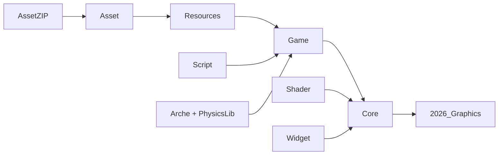

# 2026Graphics

DirectX 12 기반 실시간 3D 그래픽스 샌드박스입니다.  
렌더링, ECS, 에셋 변환, Lua 스크립팅, 물리, ImGui 디버그 도구를 직접 구현해 하나의 Win32 런타임으로 묶은 프로젝트입니다.

## 개요 

| 구분 | 내용 |
| --- | --- |
| 실행 프로젝트 | `2026_Graphics` |
| 주요 런타임 | `Core`, `Game`, `Arche`, `PhysicsLib`, `Script` |
| 도구 | `AssetZIP` |
| 디버그 UI | `Widget` |
| 데이터 | `Shader`, `Resources`, `D3D`, `External` |
| 기본 씬 | `Resources/DefaultScene.yaml` |
| 기본 설정 | `Config.prop` |
| 빌드 방식 | Visual Studio Solution, CMake Presets |

## 핵심요약

| 영역 | 요약 |
| --- | --- |
| 렌더링 | DirectX 12 기반 Deferred Rendering, G-Buffer, Shadow Map, Tone Mapping, Terrain Tessellation |
| 월드 | 커스텀 ECS `Arche`와 Phase 기반 `Game` 시스템 실행 |
| 에셋 | Assimp 임포트 후 자체 `.bin`, `.animbin`, 머티리얼 JSON으로 변환 |
| 스크립트 | Lua Behavior 생명주기와 C++ 컴포넌트 바인딩 |
| 물리 | Fixed Step Actor Simulation, HeightField Terrain, 런타임 Snapshot |
| UI | ImGui DockSpace, 성능/VRAM/콘솔/씬 계층 디버그 도구 |

## 기술스택

| 영역 | 사용 기술 |
| --- | --- |
| 언어 | C++20, C++23, Lua 5.4, HLSL |
| 플랫폼 | Windows, Win32, MSVC |
| 그래픽스 | DirectX 12, DXGI, DXC, D3DCompiler, D3D12 Agility SDK |
| 그래픽스 보조 | DirectXTK12, DirectXTex, DirectXCollision |
| UI | Dear ImGui, ImGui Win32/DX12 Backend |
| 에셋 | Assimp, 자체 모델/애니메이션 바이너리, JSON 머티리얼 |
| 데이터 | YAML, rapidyaml/c4core, rapidjson |
| 스크립팅 | Lua, sol2 |
| 유틸리티 | Boost Preprocessor, cpptrace, Abseil |

## 구조

```text
2026_Graphics.sln
CMakeLists.txt
2026_Graphics.cpp
Core/          DirectX 12 렌더링 기반
Game/          씬, 시스템, 렌더 프레임 데이터
Arche/         ECS
PhysicsLib/    물리 시뮬레이션
Script/        Lua Behavior
Asset/         에셋 임포트와 직렬화
AssetZIP/      에셋 변환 CLI
Widget/        ImGui 디버그 UI
Utility/       공용 유틸리티
Shader/        HLSL, PSO, Root Signature
Resources/     기본 씬과 런타임 리소스
External/      외부 헤더와 라이브러리
D3D/           D3D12 Agility SDK DLL
```



| 흐름 | 설명 |
| --- | --- |
| `AssetZIP -> Asset -> Resources` | 외부 에셋을 자체 런타임 리소스로 변환합니다. |
| `Resources -> Game` | 씬, 모델, 애니메이션, 머티리얼, 텍스처를 런타임 월드로 로드합니다. |
| `Arche -> Game` | ECS World와 Query 기반으로 씬 데이터를 구성합니다. |
| `PhysicsLib -> Game` | 물리 Actor와 Terrain Collision을 씬 시스템에 연결합니다. |
| `Script -> Game` | Lua Behavior가 Entity와 Component를 제어합니다. |
| `Game -> Core` | `RenderFrameData`를 만들어 DirectX 12 렌더러에 전달합니다. |
| `Shader -> Core` | HLSL, PSO, Root Signature 리소스를 렌더러가 사용합니다. |
| `Widget -> Core` | ImGui 디버그 UI를 최종 렌더 패스에 합성합니다. |
| `Core -> 2026_Graphics` | 실행 파일의 프레임 루프에서 렌더링을 수행합니다. |

## 빌드

### Visual Studio

1. `2026_Graphics.sln`을 엽니다.
2. `Debug|x64` 또는 `Release|x64`를 선택합니다.
3. `2026_Graphics`를 시작 프로젝트로 빌드합니다.

### CMake

```powershell
cmake --preset windows-msvc-debug
cmake --build --preset build-debug
```

```powershell
cmake --preset windows-msvc-release
cmake --build --preset build-release
```

빌드 후 실행 파일 출력 디렉터리에 `Config.prop`, `D3D`, `Resources`, `Script`, `Shader`, 주요 DLL이 복사됩니다.

## 핵심기능

| 분류 | 기능 |
| --- | --- |
| 렌더링 | G-Buffer, Deferred Lighting, Cascaded Shadow Mapping, Sky Dome, Debug Geometry, Bounding Box, Tone Mapping |
| GPU 리소스 | Direct/Compute/Copy Queue, Future 동기화, Descriptor Heap, GPU Heap Allocator, 업로드 큐 |
| 씬 | YAML Scene, Prefab, Entity Hierarchy, Scene Snapshot |
| ECS | Archetype, Chunk, Query Cache, Deferred Structural Change |
| 지형 | Procedural HeightField, Tiled Mesh, Splat Map, Terrain Streaming, Tessellation |
| 애니메이션 | Skinned Mesh, Animation Clip, Animation Graph, Runtime Variable Table |
| IK | Foot IK, FABRIK Solver |
| 물리 | Dynamic/Kinematic/Static Actor, HeightField Terrain Collision, Fixed Step, Snapshot |
| 스크립트 | Lua Behavior, Hot Reload, Update/FixedUpdate/LateUpdate |
| 도구 | AssetZIP 변환, ImGui Console, Performance Timeline, VRAM Monitor, Scene Hierarchy |

## 핵심 차별성

- 외부 게임 엔진 없이 렌더링, 씬, 에셋, 물리, 스크립트, UI를 직접 연결합니다.
- Scene, Material, PSO, Root Signature를 데이터 파일로 분리해 런타임 구성을 실험하기 좋습니다.
- ECS World와 Renderer 사이를 `RenderFrameData`로 분리해 시스템 결과와 GPU 업로드 경계를 명확히 둡니다.
- 에셋 변환 도구와 런타임 로더가 같은 데이터 모델을 공유합니다.
- ImGui UI가 단순 로그 표시를 넘어 씬 계층과 컴포넌트 편집 도구로 동작합니다.

## 프로젝트별 상세

<details open>
<summary><strong>2026_Graphics</strong> - Win32 실행 파일</summary>

| 항목 | 내용 |
| --- | --- |
| 프로젝트 구성 | `2026_Graphics.cpp`, `2026_Graphics.vcxproj`, `Core/`, `Config.prop` |
| 핵심요약 | 전체 런타임을 조립하는 진입점입니다. 창 생성, DirectX 12 초기화, 씬 로드, 프레임 루프를 담당합니다. |
| 기술스택 | Win32 API, DirectX 12, DirectXTK12 Keyboard/Mouse, ImGui, D3D12 Agility SDK |
| 핵심기능 | 설정 로드, 메시지 루프, 큐/할당자 초기화, 셰이더/PSO 사전 컴파일, YAML 씬 로드, 시스템 Phase 실행 |
| 핵심 차별성 | 모든 서브시스템을 연결하는 통합 지점이며, `Block_ImGui` 설정으로 디버그 UI 포함 여부를 전환할 수 있습니다. |

</details>

<details>
<summary><strong>Core</strong> - DirectX 12 렌더링 기반</summary>

| 항목 | 내용 |
| --- | --- |
| 프로젝트 구성 | `Core/DX/DirectQueue.*`, `ComputeQueue.*`, `CopyQueue.*`, `GraphicsAllocator.*`, `DrawCallDispatcher.*`, `DrawCallResourceManager.*`, `Core/Event/`, `Core/Config.*` |
| 핵심요약 | DirectX 12 장치, 큐, 렌더 타깃, G-Buffer, Shadow Map, Post Process, GPU 업로드를 관리합니다. |
| 기술스택 | DirectX 12, DXGI, DXC, D3DCompiler, DirectXTK12 |
| 핵심기능 | Direct/Compute/Copy Queue 분리, Fence/Future 동기화, Descriptor Heap, DrawRecord 배치, Tone Mapping Compute Pass |
| 핵심 차별성 | Scene이 만든 `RenderFrameData`만 소비해 렌더러와 게임 로직의 결합을 낮춥니다. |

</details>

<details>
<summary><strong>Utility</strong> - 공용 유틸리티</summary>

| 항목 | 내용 |
| --- | --- |
| 프로젝트 구성 | `Utility.vcxitems`, `DirectXInclude.h`, `ErrorHandler.*`, `StdOutput.*`, `ComponentRestraint.h`, `FixedArray.h`, `Views.h` |
| 핵심요약 | 여러 프로젝트가 공유하는 include, 로그, 오류 처리, 컴포넌트 메타 정의를 제공합니다. |
| 기술스택 | C++20/23, Boost Preprocessor, std::format, DirectX include 계층 |
| 핵심기능 | Lua 바인딩 메타데이터 생성, Trivial Component 제약, 로그 Sink, 오류 리포팅, 공용 컨테이너 |
| 핵심 차별성 | C++ 컴포넌트 선언과 Lua 노출 정보를 한 번에 정의해 중복을 줄입니다. |

</details>

<details>
<summary><strong>Arche</strong> - 커스텀 ECS</summary>

| 항목 | 내용 |
| --- | --- |
| 프로젝트 구성 | `World.*`, `ArcheType.*`, `TypeSystem.*`, `Memory.*`, `Common.h` |
| 핵심요약 | Archetype과 Chunk 기반으로 엔티티와 컴포넌트를 저장하는 ECS 라이브러리입니다. |
| 기술스택 | C++ 템플릿, FNV-1a TypeHash, std::shared_mutex, std::atomic |
| 핵심기능 | Entity 생성/삭제, Component 추가/조회, Query Cache, Deferred Structural Change, WorldReadOnlyView |
| 핵심 차별성 | 같은 컴포넌트 조합을 Chunk에 연속 배치해 시스템 순회에 유리합니다. |

</details>

<details>
<summary><strong>Asset</strong> - 에셋 임포트와 직렬화</summary>

| 항목 | 내용 |
| --- | --- |
| 프로젝트 구성 | `AssimpAssetImporter.*`, `AssimpAnimationClipImporter.*`, `AssetBinaryReader/Writer.*`, `AnimationBinaryReader.*`, `AnimationClipBinaryWriter.*`, `MaterialGroupJsonSerializer.*`, `ModelResult.*`, `AnimationClipResult.*` |
| 핵심요약 | 외부 모델과 애니메이션을 런타임 친화적인 자체 포맷으로 변환하고 다시 읽습니다. |
| 기술스택 | Assimp, DirectX SimpleMath, DirectXCollision, JSON, 자체 `.bin`/`.animbin` |
| 핵심기능 | FBX/glTF/GLB 임포트, Vertex/Bone/SubMesh 저장, Animation Clip 저장, Material Group JSON 직렬화 |
| 핵심 차별성 | Skinned Mesh, Animation, Terrain Material까지 같은 에셋 파이프라인에서 다룹니다. |

</details>

<details>
<summary><strong>AssetZIP</strong> - 에셋 변환 CLI</summary>

| 항목 | 내용 |
| --- | --- |
| 프로젝트 구성 | `AssetZIP/AssetZIP.cpp`, `AssetZIP.vcxproj` |
| 핵심요약 | FBX, glTF, GLB 파일을 모델 바이너리, 애니메이션 바이너리, 머티리얼 JSON으로 변환하는 콘솔 도구입니다. |
| 기술스택 | C++ 콘솔 앱, Assimp, `Asset` 라이브러리, std::filesystem |
| 핵심기능 | `model`, `animation`, `help`, `--flip-uv=true|false`, 변환 결과 통계 출력 |
| 핵심 차별성 | 런타임에서 Assimp를 직접 쓰지 않도록 오프라인 변환 흐름을 제공합니다. |

```powershell
AssetZIP model Knight.fbx --flip-uv=true
AssetZIP animation Knight.fbx
```

</details>

<details open>
<summary><strong>Game</strong> - 씬과 게임 런타임</summary>

| 항목 | 내용 |
| --- | --- |
| 프로젝트 구성 | `Game/Base/`, `Game/Model/`, `Game/Asset/`, `Game/Scene/`, `Game/Scene/Components/`, `Game/Scene/Systems/`, `Game/Scene/IK/` |
| 핵심요약 | ECS World를 실행하고, 씬 시스템 결과를 `RenderFrameData`로 만들어 렌더러에 전달합니다. |
| 기술스택 | C++20/23, DirectX SimpleMath, rapidyaml, Lua/sol2, PhysicsLib |
| 핵심기능 | YAML Scene, System Scheduler, AssetRegistry, Terrain, Animation Graph, Skinned Mesh, Camera, Foot IK, PhysicsActor 동기화 |
| 핵심 차별성 | Component/Resource 접근 충돌을 고려한 시스템 배치와 렌더 프레임 패킷 분리가 핵심 구조입니다. |

</details>

<details>
<summary><strong>PhysicsLib</strong> - 물리 시뮬레이션</summary>

| 항목 | 내용 |
| --- | --- |
| 프로젝트 구성 | `World/PhysicsWorld.*`, `Actors/`, `Actors/CollisionSolver/`, `Actors/Integrater/`, `Simulation/`, `Runtime/` |
| 핵심요약 | Actor 기반 Fixed Step 물리 월드와 렌더 보간 상태를 제공하는 자체 물리 라이브러리입니다. |
| 기술스택 | C++20, DirectXCollision, DirectX SimpleMath, std::thread, std::atomic |
| 핵심기능 | Dynamic/Kinematic/Static Actor, HeightField Terrain, 충돌 이벤트, Spatial Query, Triple Buffered Snapshot |
| 핵심 차별성 | 충돌/적분/제약 Solver를 정책 기반 Actor 템플릿으로 조합합니다. |

</details>

<details>
<summary><strong>Script</strong> - Lua Behavior</summary>

| 항목 | 내용 |
| --- | --- |
| 프로젝트 구성 | `Script/Core/LuaScriptFramework.*`, `Script/Lua/Global/`, `CameraController.lua`, `PlayerBehavior.lua`, `BehaviorStandardTemplate.lua` |
| 핵심요약 | Entity에 Lua Behavior를 붙이고 C++ 컴포넌트를 Lua에서 조회/수정할 수 있게 합니다. |
| 기술스택 | Lua 5.4, sol2, C++ 템플릿 컴포넌트 등록 |
| 핵심기능 | Awake/Start/Update/FixedUpdate/LateUpdate, Hot Reload, Behavior Instance, 기본 입력/수학 함수 |
| 핵심 차별성 | Behavior별 독립 Lua 환경과 C++ 컴포넌트 메타 기반 바인딩을 사용합니다. |

</details>

<details>
<summary><strong>Widget</strong> - ImGui 디버그 UI</summary>

| 항목 | 내용 |
| --- | --- |
| 프로젝트 구성 | `WidgetCore.*`, `Console.*`, `PerformanceProvider.*`, `PerformanceWidgets.*`, `SceneHierarchyWidget.*` |
| 핵심요약 | 런타임 상태를 확인하고 일부 씬/컴포넌트 값을 편집하는 ImGui 도구 모음입니다. |
| 기술스택 | Dear ImGui, ImGui Win32/DX12 Backend, DXGI VRAM Query, SceneWorldSnapshot |
| 핵심기능 | DockSpace, Console, Frame Time, FPS Percentile, Timeline, VRAM, Scene Hierarchy, Shadow Map Preview |
| 핵심 차별성 | ECS World를 직접 잠그지 않고 Snapshot 기반으로 UI를 구성합니다. |

</details>

<details>
<summary><strong>Shader</strong> - HLSL과 파이프라인 데이터</summary>

| 항목 | 내용 |
| --- | --- |
| 프로젝트 구성 | `Shader/Source/`, `Shader/Binarys/`, `Shader/PSO/`, `Shader/RS/`, `ShaderMetadata.txt` |
| 핵심요약 | 렌더링 파이프라인의 HLSL 소스, 컴파일 결과, PSO, Root Signature 설정을 담습니다. |
| 기술스택 | HLSL, DXC, D3DCompiler, JSON |
| 핵심기능 | Basic, Skinned, Terrain, Sky Dome, Debug Geometry, Deferred Lighting, Tone Mapping |
| 핵심 차별성 | PSO와 Root Signature를 코드가 아니라 JSON 리소스로 관리합니다. |

</details>

<details>
<summary><strong>Resources</strong> - 기본 씬과 런타임 리소스</summary>

| 항목 | 내용 |
| --- | --- |
| 프로젝트 구성 | `DefaultScene.yaml`, `ShadowMappingParameter.yaml`, `DefaultResource/`, `DefaultScene/`, `Font/` |
| 핵심요약 | 실행 가능한 기본 씬과 모델, 애니메이션, 머티리얼, 텍스처, 폰트를 포함합니다. |
| 기술스택 | YAML, DDS, PNG, JSON, 자체 `.bin`/`.animbin` |
| 핵심기능 | 기본 카메라, Primitive Prefab, Skinned Mesh, Animation Graph, Terrain, Sky Dome, Shadow 설정 |
| 핵심 차별성 | 코드 수정 없이 씬과 렌더 리소스 구성을 데이터 파일로 바꿀 수 있습니다. |

</details>

## 런타임 흐름

```text
Config 로드
Win32 창 생성
Direct/Compute/Copy Queue 초기화
Shader, Root Signature, Pipeline 사전 컴파일
DefaultScene.yaml 로드
Scene Phase 실행
RenderFrameData 생성
Core 렌더러가 GPU 리소스 업로드 및 Draw 실행
ImGui Widget 렌더링
```
